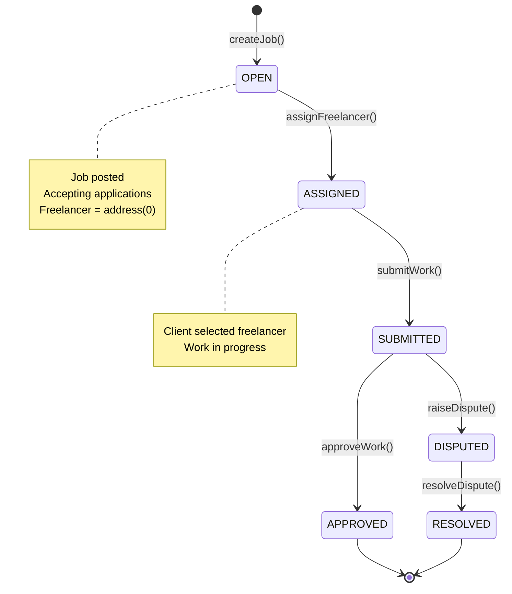
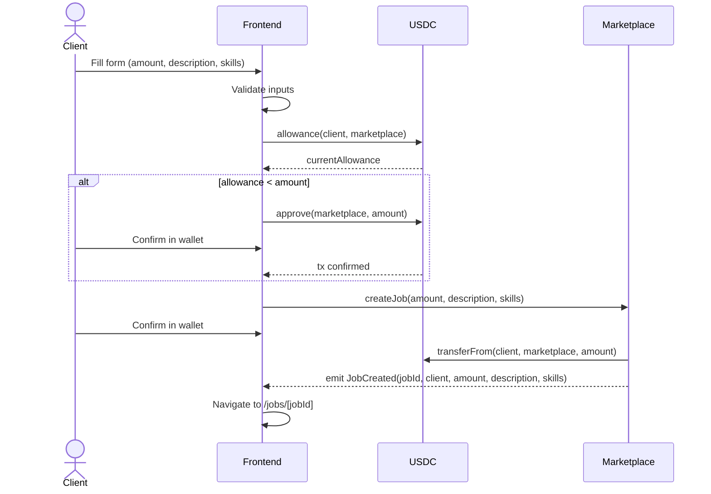
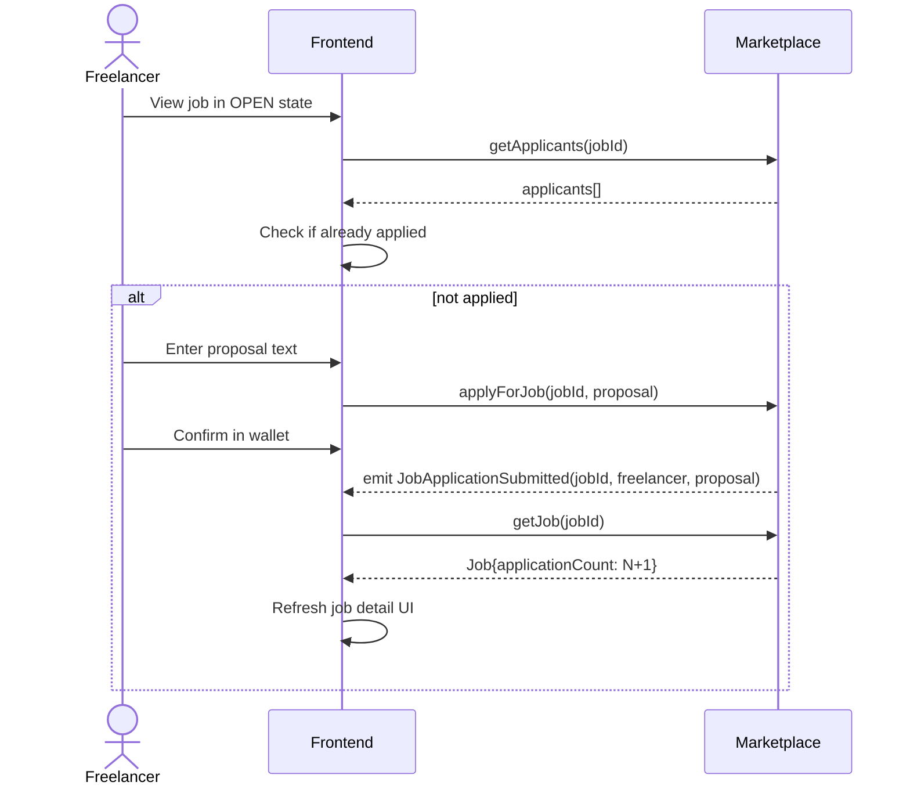
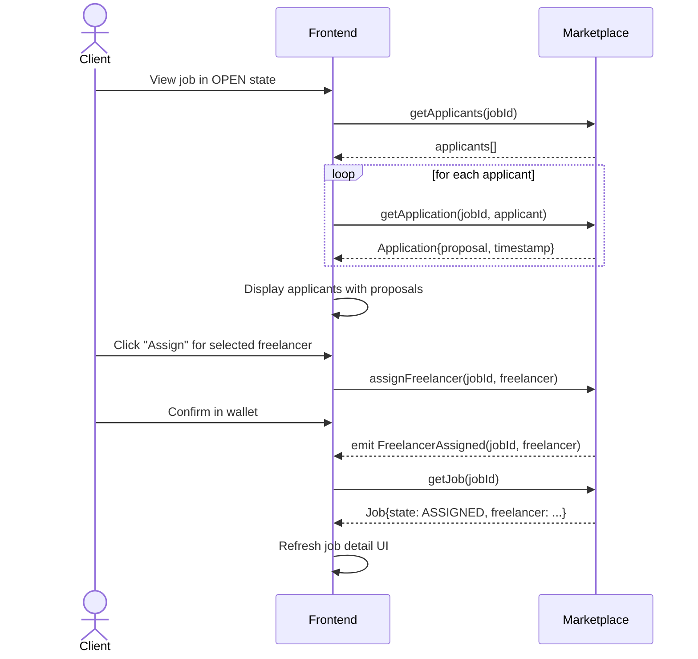
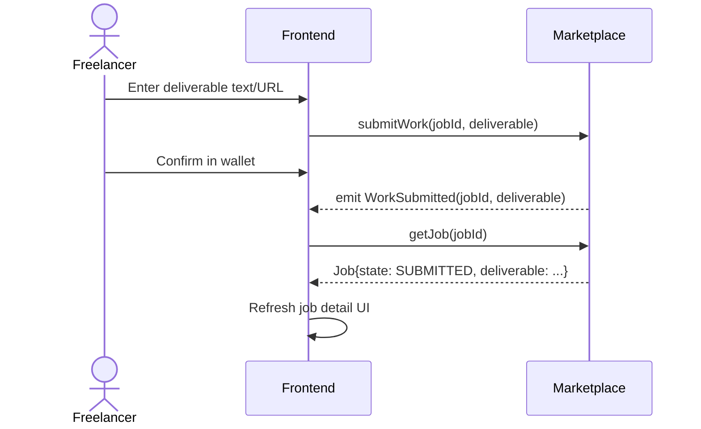
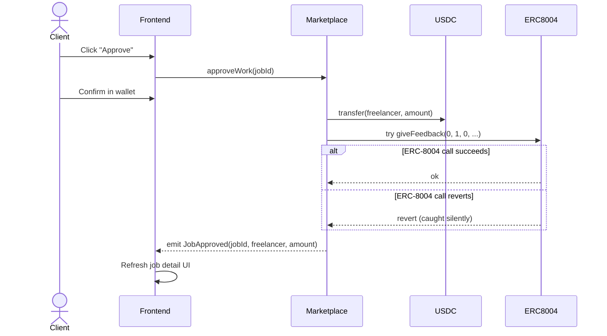
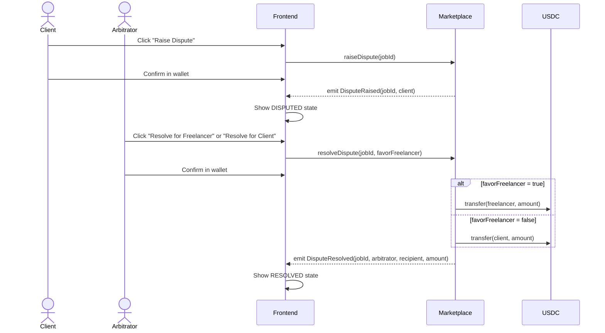

# Design Document: ArcHire Freelancer Marketplace

## Overview

This document describes the technical design for **ArcHire**, a decentralized freelance marketplace deployed on Arc Testnet (Chain ID 5042002). The system allows Clients to post jobs with descriptions and required skills, Freelancers to apply with proposals, and Clients to select the best candidate from applicants. The smart contract (FreelancerMarketplace.sol) holds USDC in escrow, enforces a state machine (OPEN → ASSIGNED → SUBMITTED → APPROVED/DISPUTED → RESOLVED), and integrates with ERC-8004 for onchain reputation updates.

### Research Summary

Key findings that inform this design:

- **USDC on Arc**: The ERC-20 interface is at `0x3600000000000000000000000000000000000000` and uses **6 decimals** for ERC-20 operations (e.g., `approve`, `transferFrom`). The native balance uses 18 decimals for gas accounting, but all ERC-20 token amounts use 6 decimals. ([Arc contract addresses](https://docs.arc.network/arc/references/contract-addresses))
- **ERC-8004 ReputationRegistry**: The `giveFeedback(uint256 agentId, int128 value, uint8 valueDecimals, ...)` function requires the target to have a registered `agentId` in the IdentityRegistry. Since freelancers may not be registered, all calls must be wrapped in `try/catch`. ([EIP-8004](https://eips.ethereum.org/EIPS/eip-8004))
- **FreelancerMarketplace.sol**: Deployed at `0x07191A01Ab724aA7c59F272946E533ec142d7E0F` on Arc Testnet. Implements a job marketplace with application system, skills matching, and dispute resolution.
- **viem**: The `arcTestnet` chain is available in `viem/chains`, providing the correct chain config out of the box.
- **Arc Explorer**: `https://testnet.arcscan.network`

---

## Architecture

The system has two layers: a Solidity smart contract on Arc Testnet and a Next.js frontend. There is no backend — all state lives onchain.

```mermaid
graph TB
    subgraph "Arc Testnet (Chain ID 5042002)"
        FC[FreelancerMarketplace.sol\n0x07191A01...]
        USDC[USDC ERC-20\n0x3600...0000]
        IR[IdentityRegistry\n0x8004A818...]
        RR[ReputationRegistry\n0x8004B663...]
        VR[ValidationRegistry\n0x8004Cb1B...]
        FC -->|transferFrom / transfer| USDC
        FC -->|try giveFeedback| RR
        RR -->|reads| IR
    end

    subgraph "Frontend (Next.js 14 - ArcHire)"
        WC[Wallet Connection\nRainbowKit + wagmi]
        JL[Job List Page\n/jobs]
        JD[Job Detail Page\n/jobs/[id]]
        CF[Create Job Form\n/jobs/new]
        AL[Applications List\nClient reviews applicants]
        AF[Apply Form\nFreelancer submits proposal]
        WC --> JL
        WC --> JD
        WC --> CF
        JD --> AL
        JD --> AF
    end

    JL -->|useReadContract| FC
    JD -->|useReadContract\nuseWriteContract| FC
    CF -->|useWriteContract| FC
    AL -->|useApplicants\nuseAssignFreelancer| FC
    AF -->|useApplyForJob| FC
    WC -->|viem arcTestnet chain| USDC
```

### Key Design Decisions

1. **USDC via ERC-20 interface**: The escrow uses `IERC20.transferFrom` to pull funds from the Client on job creation, and `IERC20.transfer` to release funds. This requires the Client to `approve` the marketplace contract before calling `createJob`. The frontend handles this as a two-step flow (approve → createJob) or uses a single combined call if the allowance is already sufficient.

2. **Application system**: Jobs start in OPEN state with no assigned freelancer (address(0)). Freelancers submit applications with proposals. The Client reviews all applicants and selects one, transitioning the job to ASSIGNED state. This replaces the direct freelancer assignment at job creation.

3. **Job descriptions and skills**: Each job includes a description (max 2048 characters) explaining the work, and an array of required skills (max 10 skills) for matching. These are stored onchain and displayed in the UI.

4. **ERC-8004 integration via try/catch**: The `giveFeedback` call on the ReputationRegistry is wrapped in a Solidity `try/catch`. If the freelancer has no registered `agentId`, or if the call reverts for any reason, the escrow silently continues.

5. **Single arbitrator**: The arbitrator address is set once at deployment via the constructor and is immutable. There is no per-job arbitrator configuration.

6. **Deliverable as string**: The deliverable is stored as a `string` onchain (plain text or URL, max 2048 characters enforced in the contract).

7. **Job IDs start at 0**: The first job created has ID 0, incrementing by 1 for each subsequent job.

---

## Components and Interfaces

### Smart Contract: `FreelancerMarketplace.sol`

#### State Machine



Valid state transitions:
- `OPEN → ASSIGNED`: Only the Client can call `assignFreelancer` with an address that has applied
- `ASSIGNED → SUBMITTED`: Only the assigned Freelancer can call `submitWork`
- `SUBMITTED → APPROVED`: Only the Client can call `approveWork`; triggers USDC transfer to Freelancer
- `SUBMITTED → DISPUTED`: Only the Client can call `raiseDispute`; locks funds
- `DISPUTED → RESOLVED`: Only the Arbitrator can call `resolveDispute`; releases funds to winner

#### Solidity Interface

```solidity
// SPDX-License-Identifier: MIT
pragma solidity ^0.8.24;

interface IFreelancerMarketplace {
    // ── Enums ──────────────────────────────────────────────────────────────
    enum JobState { OPEN, ASSIGNED, SUBMITTED, APPROVED, DISPUTED, RESOLVED }

    // ── Structs ────────────────────────────────────────────────────────────
    struct Job {
        uint256 id;
        address client;
        address freelancer;      // address(0) until assigned
        uint256 amount;          // USDC amount in 6-decimal units
        JobState state;
        string description;      // Job description (what needs to be done)
        string[] requiredSkills; // Required skills (e.g., ["Solidity", "React"])
        string deliverable;      // Submitted work (empty until submitted)
        uint256 applicationCount; // Number of applications
    }

    struct Application {
        address freelancer;
        string proposal;         // Why they're a good fit
        uint256 timestamp;
    }

    // ── Events ─────────────────────────────────────────────────────────────
    event JobCreated(
        uint256 indexed jobId,
        address indexed client,
        uint256 amount,
        string description,
        string[] requiredSkills
    );

    event JobApplicationSubmitted(
        uint256 indexed jobId,
        address indexed freelancer,
        string proposal
    );

    event FreelancerAssigned(
        uint256 indexed jobId,
        address indexed freelancer
    );

    event WorkSubmitted(
        uint256 indexed jobId,
        string deliverable
    );

    event JobApproved(
        uint256 indexed jobId,
        address indexed freelancer,
        uint256 amount
    );

    event DisputeRaised(
        uint256 indexed jobId,
        address indexed client
    );

    event DisputeResolved(
        uint256 indexed jobId,
        address indexed arbitrator,
        address indexed recipient,
        uint256 amount
    );

    // ── Write Functions ────────────────────────────────────────────────────

    /// @notice Create a new job posting with description and required skills.
    /// @dev Caller must have approved this contract for `amount` USDC beforehand.
    /// @param amount          USDC amount in 6-decimal units (must be > 0).
    /// @param description     Job description explaining what needs to be done.
    /// @param requiredSkills  Array of required skills (max 10).
    /// @return jobId          The ID of the newly created job.
    function createJob(
        uint256 amount,
        string calldata description,
        string[] calldata requiredSkills
    ) external returns (uint256 jobId);

    /// @notice Apply for an open job.
    /// @dev Only callable when job is in OPEN state.
    /// @param jobId    The job to apply for.
    /// @param proposal Why you're a good fit for this job.
    function applyForJob(uint256 jobId, string calldata proposal) external;

    /// @notice Assign a freelancer to the job from applicants.
    /// @dev Only callable by client when job is in OPEN state.
    /// @param jobId      The job to assign.
    /// @param freelancer The freelancer address to assign.
    function assignFreelancer(uint256 jobId, address freelancer) external;

    /// @notice Submit work deliverable for an assigned job.
    /// @dev Only callable by assigned freelancer.
    /// @param jobId       The job to submit work for.
    /// @param deliverable Link or description of completed work.
    function submitWork(uint256 jobId, string calldata deliverable) external;

    /// @notice Approve submitted work and release USDC to the freelancer.
    /// @dev Only callable by the client. Attempts ERC-8004 reputation update (silent on failure).
    /// @param jobId The job to approve.
    function approveWork(uint256 jobId) external;

    /// @notice Raise a dispute on submitted work.
    /// @dev Only callable by the client. Locks funds until arbitrator resolves.
    /// @param jobId The job to dispute.
    function raiseDispute(uint256 jobId) external;

    /// @notice Resolve a disputed job.
    /// @dev Only callable by the arbitrator.
    /// @param jobId          The disputed job to resolve.
    /// @param favorFreelancer True to pay the freelancer; false to refund the client.
    function resolveDispute(uint256 jobId, bool favorFreelancer) external;

    // ── Read Functions ─────────────────────────────────────────────────────

    /// @notice Get full details of a job.
    /// @param jobId The job ID to query (reverts if it does not exist).
    function getJob(uint256 jobId) external view returns (Job memory);

    /// @notice Get all applicants for a job.
    /// @param jobId The job ID.
    /// @return applicants Array of applicant addresses.
    function getApplicants(uint256 jobId) external view returns (address[] memory);

    /// @notice Get application details for a specific freelancer.
    /// @param jobId      The job ID.
    /// @param freelancer The freelancer address.
    /// @return application The application struct.
    function getApplication(uint256 jobId, address freelancer) 
        external 
        view 
        returns (Application memory);

    /// @notice Total number of jobs ever created.
    function jobCount() external view returns (uint256);

    /// @notice The contract-level arbitrator address.
    function arbitrator() external view returns (address);
}
```

#### ERC-8004 Integration Pattern

The contract calls `giveFeedback` on the ReputationRegistry to increment a freelancer's reputation by 1 (value=1, valueDecimals=0) after a successful job completion. Because the freelancer may not have a registered agent identity, the call is wrapped in a `try/catch` block. The contract attempts to call `giveFeedback` with `agentId = 0` as a fallback. If the freelancer has no registered identity, the call reverts and is silently caught.

```solidity
// ERC-8004 reputation update pattern (inside approveWork / resolveDispute)
IReputationRegistry reputationRegistry = IReputationRegistry(REPUTATION_REGISTRY);

try reputationRegistry.giveFeedback(
    0,            // agentId — will revert if not registered; caught silently
    1,            // value: +1 reputation point
    0,            // valueDecimals
    "marketplace",// tag1
    "",           // tag2
    "",           // endpoint
    "",           // feedbackURI
    bytes32(0)    // feedbackHash
) {} catch {}
// USDC transfer and event emission proceed regardless
```

#### ERC-8004 Interface (minimal, for try/catch)

```solidity
interface IReputationRegistry {
    function giveFeedback(
        uint256 agentId,
        int128 value,
        uint8 valueDecimals,
        string calldata tag1,
        string calldata tag2,
        string calldata endpoint,
        string calldata feedbackURI,
        bytes32 feedbackHash
    ) external;
}
```

### Frontend Components

```
src/
├── app/
│   ├── layout.tsx              # Root layout with WagmiProvider + RainbowKitProvider
│   ├── page.tsx                # Redirect to /jobs
│   ├── jobs/
│   │   ├── page.tsx            # Job list view (public)
│   │   ├── new/
│   │   │   └── page.tsx        # Create job form
│   │   └── [id]/
│   │       └── page.tsx        # Job detail view
├── components/
│   ├── ConnectButton.tsx       # RainbowKit ConnectButton wrapper + network check
│   ├── NetworkGuard.tsx        # Prompts switch to Arc Testnet if wrong chain
│   ├── UsdcBalance.tsx         # Displays connected wallet USDC balance
│   ├── JobCard.tsx             # Job summary card for list view
│   ├── JobDetail.tsx           # Full job detail with role-based actions
│   ├── CreateJobForm.tsx       # Form with validation for job creation (description + skills)
│   ├── ApplyForJobForm.tsx     # Application submission form with proposal textarea
│   ├── ApplicationsList.tsx    # Client reviews applicants and assigns freelancer
│   ├── SubmitWorkForm.tsx      # Deliverable input form
│   ├── ActionButtons.tsx       # Role-aware approve/dispute/resolve buttons
│   └── TxNotification.tsx      # Pending/success/error toast notifications
├── lib/
│   ├── wagmi.ts                # wagmi config + Arc Testnet chain definition
│   ├── contracts.ts            # Contract addresses + ABIs
│   ├── hooks/
│   │   ├── useJob.ts           # useReadContract wrapper for getJob
│   │   ├── useJobCount.ts      # useReadContract wrapper for jobCount
│   │   ├── useCreateJob.ts     # useWriteContract + approve flow
│   │   ├── useApplyForJob.ts   # useWriteContract for applyForJob
│   │   ├── useApplicants.ts    # useReadContract for getApplicants
│   │   ├── useApplication.ts   # useReadContract for getApplication
│   │   ├── useAssignFreelancer.ts # useWriteContract for assignFreelancer
│   │   ├── useSubmitWork.ts    # useWriteContract for submitWork
│   │   ├── useApproveWork.ts   # useWriteContract for approveWork
│   │   ├── useRaiseDispute.ts  # useWriteContract for raiseDispute
│   │   ├── useResolveDispute.ts # useWriteContract for resolveDispute
│   │   └── useUsdcBalance.ts   # useBalance for USDC balance
│   └── utils.ts                # Address formatting, amount formatting, error parsing
└── constants/
    └── index.ts                # Chain ID, contract addresses, explorer URL
```

---

## Data Models

### Onchain Job Struct

```solidity
struct Job {
    uint256 id;              // Auto-incremented from 0
    address client;          // Wallet that created and funded the job
    address freelancer;      // Wallet assigned to perform the work (address(0) until assigned)
    uint256 amount;          // USDC amount in 6-decimal units (e.g., 5_000_000 = 5 USDC)
    JobState state;          // Current state in the state machine
    string description;      // Job description (what needs to be done)
    string[] requiredSkills; // Required skills (e.g., ["Solidity", "React"])
    string deliverable;      // Submitted deliverable (empty until submitWork is called)
    uint256 applicationCount; // Number of applications received
}

enum JobState {
    OPEN,       // 0 — Job posted, accepting applications
    ASSIGNED,   // 1 — Freelancer selected, work in progress
    SUBMITTED,  // 2 — Freelancer submitted deliverable
    APPROVED,   // 3 — Client approved, funds released to freelancer
    DISPUTED,   // 4 — Client raised dispute, funds locked
    RESOLVED    // 5 — Arbitrator resolved, funds released to winner
}
```

### Onchain Application Struct

```solidity
struct Application {
    address freelancer;  // Applicant's wallet address
    string proposal;     // Why they're a good fit for this job
    uint256 timestamp;   // When the application was submitted
}
```

### Contract Storage Layout

```solidity
contract FreelancerMarketplace {
    // Immutable configuration
    address public immutable arbitrator;
    IERC20 public immutable usdc;                    // 0x3600...0000
    IReputationRegistry public immutable reputationRegistry; // 0x8004B663...

    // Job storage
    uint256 private _jobCount;
    mapping(uint256 => Job) private _jobs;
    
    // Application storage
    mapping(uint256 => mapping(address => Application)) private _applications;
    mapping(uint256 => address[]) private _applicants;

    // Constants
    uint256 public constant MAX_DESCRIPTION_LENGTH = 2048;
    uint256 public constant MAX_DELIVERABLE_LENGTH = 2048;
    uint256 public constant MAX_SKILLS = 10;
}
```

### Frontend Job Type (TypeScript)

```typescript
export type JobState = 'OPEN' | 'ASSIGNED' | 'SUBMITTED' | 'APPROVED' | 'DISPUTED' | 'RESOLVED';

export interface Job {
  id: bigint;
  client: `0x${string}`;
  freelancer: `0x${string}`;  // address(0) until assigned
  amount: bigint;              // USDC in 6-decimal units
  state: JobState;
  description: string;
  requiredSkills: string[];
  deliverable: string;
  applicationCount: bigint;
}

export interface Application {
  freelancer: `0x${string}`;
  proposal: string;
  timestamp: bigint;
}

// State badge colors for UI
export const STATE_COLORS: Record<JobState, string> = {
  OPEN:      'bg-blue-100 text-blue-800',
  ASSIGNED:  'bg-purple-100 text-purple-800',
  SUBMITTED: 'bg-yellow-100 text-yellow-800',
  APPROVED:  'bg-green-100 text-green-800',
  DISPUTED:  'bg-red-100 text-red-800',
  RESOLVED:  'bg-gray-100 text-gray-800',
};
```

### Arc Testnet Chain Configuration (wagmi/viem)

```typescript
// lib/wagmi.ts
import { getDefaultConfig } from '@rainbow-me/rainbowkit';
import { arcTestnet } from 'viem/chains';  // built-in viem chain

export const config = getDefaultConfig({
  appName: 'Freelancer Escrow',
  projectId: process.env.NEXT_PUBLIC_WALLETCONNECT_PROJECT_ID!,
  chains: [arcTestnet],
  ssr: true,
});

// arcTestnet from viem/chains provides:
// {
//   id: 5042002,
//   name: 'Arc Testnet',
//   nativeCurrency: { name: 'USDC', symbol: 'USDC', decimals: 18 },
//   rpcUrls: { default: { http: ['https://rpc.testnet.arc.network'] } },
//   blockExplorers: { default: { name: 'ArcScan', url: 'https://testnet.arcscan.network' } },
// }
```

### Contract Constants

```typescript
// constants/index.ts
export const ARC_TESTNET_CHAIN_ID = 5042002;

export const USDC_ADDRESS = '0x3600000000000000000000000000000000000000' as const;
export const USDC_DECIMALS = 6; // ERC-20 interface uses 6 decimals

export const FREELANCER_MARKETPLACE_ADDRESS = '0x07191A01Ab724aA7c59F272946E533ec142d7E0F' as const;

// ERC-8004 contracts (for display/reference only — called from the smart contract)
export const IDENTITY_REGISTRY   = '0x8004A818BFB912233c491871b3d84c89A494BD9e' as const;
export const REPUTATION_REGISTRY = '0x8004B663056A597Dffe9eCcC1965A193B7388713' as const;
export const VALIDATION_REGISTRY = '0x8004Cb1BF31DAf7788923b405b754f57acEB4272' as const;

export const EXPLORER_URL = 'https://testnet.arcscan.network';
```

---

## Correctness Properties

*A property is a characteristic or behavior that should hold true across all valid executions of a system — essentially, a formal statement about what the system should do. Properties serve as the bridge between human-readable specifications and machine-verifiable correctness guarantees.*

PBT is applicable here because the core logic is a pure state machine with clear input/output behavior. The contract functions are deterministic given the same inputs, and input variation (different addresses, amounts, deliverables) reveals edge cases in access control, state transitions, and fund accounting. We use Foundry's built-in fuzzing (`forge-std`) for property-based testing.

**Property Reflection:**

After reviewing all testable criteria, the following consolidations apply:
- 1.3, 1.4, 1.5 (invalid input reverts) are all edge cases of the same input validation property — consolidated into Property 2.
- 2.3, 3.3, 4.3, 5.4 (wrong-state reverts) are all instances of the state machine invariant — consolidated into Property 7.
- 3.5 and 5.6 (ERC-8004 failure resilience) test the same pattern — consolidated into Property 8.
- 1.6, 2.5, 3.4, 4.4, 5.5 (event emission) are all instances of the same event correctness pattern — consolidated into Property 9.
- 3.2 and 4.2 (non-client reverts) and 5.3 (non-arbitrator reverts) are all access control — consolidated into Property 6.

---

### Property 1: Job creation stores correct data (round-trip)

*For any* valid client address, positive USDC amount, non-empty job description (up to 2048 characters), and skills array (up to 10 skills), calling `createJob` and then `getJob` with the returned ID SHALL return a Job with the exact same client, amount, description, and skills, with state `OPEN`, freelancer address set to address(0), an empty deliverable, and applicationCount of 0.

**Validates: Requirements 1.1, 8.1**

---

### Property 2: Invalid job creation inputs always revert

*For any* job creation call where the amount is zero, the description is empty, the description exceeds 2048 characters, or the skills array contains more than 10 skills, the transaction SHALL revert with a descriptive error and no job SHALL be created.

**Validates: Requirements 1.3, 1.4, 1.5, 1.6**

---

### Property 3: Job IDs are sequential and unique

*For any* sequence of N valid job creations, the resulting job IDs SHALL be exactly 0, 1, 2, ..., N-1 in creation order, and `jobCount()` SHALL return N after all creations.

**Validates: Requirements 1.2, 8.3**

---

### Property 4: Application submission stores correct data

*For any* job in `OPEN` state and any non-client address that has not already applied, calling `applyForJob` with a non-empty proposal SHALL store an Application with the correct freelancer address, proposal text, and timestamp, increment the job's applicationCount by 1, and the freelancer SHALL appear in the applicants list returned by `getApplicants`.

**Validates: Requirements 2.1, 3.1**

---

### Property 5: Application access control and state validation

*For any* application attempt where the job is not in `OPEN` state, the caller is the client, or the caller has already applied, the transaction SHALL revert with a descriptive error and no application SHALL be stored.

**Validates: Requirements 2.2, 2.3, 2.4**

---

### Property 6: Freelancer assignment transitions state correctly

*For any* job in `OPEN` state with at least one application, calling `assignFreelancer` by the client with an address that has applied SHALL transition the job to `ASSIGNED` state, set the job's freelancer field to the selected address, and subsequent calls to `getJob` SHALL return the updated state and freelancer address.

**Validates: Requirements 3.3**

---

### Property 7: Assignment access control

*For any* job and any caller address that is not the client, or any freelancer address that has not applied, calling `assignFreelancer` SHALL revert with a descriptive error and the job state SHALL remain unchanged.

**Validates: Requirements 3.4, 3.5, 3.6**

---

### Property 8: Work submission stores deliverable and transitions state

*For any* job in `ASSIGNED` state and any non-empty deliverable string (up to 2048 characters), calling `submitWork` by the assigned freelancer SHALL transition the job to `SUBMITTED` state and store the deliverable such that `getJob` returns the exact same deliverable string.

**Validates: Requirements 4.1**

---

### Property 9: Approval releases full USDC amount to freelancer

*For any* job in `SUBMITTED` state with amount A, calling `approveWork` by the client SHALL transition the job to `APPROVED` state and increase the freelancer's USDC balance by exactly A, while the marketplace contract's USDC balance decreases by exactly A.

**Validates: Requirements 5.1**

---

### Property 10: Access control — only authorized callers succeed

*For any* job and any caller address that is not the authorized party for a given action (submitWork: non-freelancer; approveWork/raiseDispute: non-client; resolveDispute: non-arbitrator; assignFreelancer: non-client), the transaction SHALL revert with a descriptive error and the job state SHALL remain unchanged.

**Validates: Requirements 3.4, 4.2, 5.2, 6.2, 7.3**

---

### Property 11: State machine rejects out-of-order transitions

*For any* job in state S and any function call that requires a different state (e.g., calling `approveWork` on an `OPEN` job, or `submitWork` on a `SUBMITTED` job, or `assignFreelancer` on an `ASSIGNED` job), the transaction SHALL revert with a descriptive error and the job state SHALL remain S.

**Validates: Requirements 2.2, 3.5, 4.3, 5.3, 6.3, 7.4**

---

### Property 12: ERC-8004 failure never blocks payment

*For any* job approval or dispute resolution in favor of the freelancer, even when the ERC-8004 ReputationRegistry call reverts (simulated by deploying a mock that always reverts), the USDC transfer to the freelancer SHALL complete successfully and the appropriate event SHALL be emitted.

**Validates: Requirements 5.5, 7.6**

---

### Property 13: Events contain correct fields for all state transitions

*For any* valid state transition, the emitted event SHALL contain field values that exactly match the job's stored data: `JobCreated` matches creation inputs (amount, description, skills); `JobApplicationSubmitted` matches the freelancer and proposal; `FreelancerAssigned` matches the assigned freelancer address; `WorkSubmitted` matches the stored deliverable; `JobApproved` matches the freelancer address and amount; `DisputeRaised` matches the client address; `DisputeResolved` matches the arbitrator, recipient, and amount.

**Validates: Requirements 1.7, 2.5, 3.7, 4.6, 5.4, 6.4, 7.5**

---

### Property 14: Dispute locks funds; resolution releases correct amount

*For any* job in `DISPUTED` state with amount A, calling `resolveDispute(jobId, true)` SHALL increase the freelancer's USDC balance by exactly A, and calling `resolveDispute(jobId, false)` SHALL increase the client's USDC balance by exactly A. In both cases the job transitions to `RESOLVED` and the marketplace contract's balance decreases by exactly A.

**Validates: Requirements 6.1, 7.1, 7.2**

---

## Error Handling

### Smart Contract Errors

The contract uses custom errors (Solidity 0.8.4+) for gas efficiency and descriptive revert reasons:

```solidity
// Input validation
error ZeroAmount();
error ZeroAddress();
error SelfAssignment();
error DescriptionEmpty();
error DescriptionTooLong(uint256 length, uint256 maxLength);
error DeliverableEmpty();
error DeliverableTooLong(uint256 length, uint256 maxLength);
error TooManySkills(uint256 provided, uint256 max);

// Access control
error NotFreelancer(address caller, address expected);
error NotClient(address caller, address expected);
error NotArbitrator(address caller, address expected);

// State machine
error InvalidState(uint256 jobId, JobState current, JobState required);

// Job and application existence
error JobNotFound(uint256 jobId);
error AlreadyApplied(uint256 jobId, address freelancer);
error NoApplications(uint256 jobId);
error ApplicationNotFound(uint256 jobId, address freelancer);

// Token transfer
error TransferFailed();
```

### Frontend Error Handling

The frontend parses contract revert reasons using viem's `decodeErrorResult` and maps them to human-readable messages:

```typescript
// lib/utils.ts
import { decodeErrorResult } from 'viem';
import { MARKETPLACE_ABI } from './contracts';

export function parseContractError(error: unknown): string {
  if (error instanceof Error) {
    // Try to decode custom error
    try {
      const match = error.message.match(/0x[0-9a-fA-F]+/);
      if (match) {
        const decoded = decodeErrorResult({ abi: MARKETPLACE_ABI, data: match[0] as `0x${string}` });
        return formatErrorName(decoded.errorName, decoded.args);
      }
    } catch {}

    // User rejected transaction
    if (error.message.includes('User rejected') || error.message.includes('user rejected')) {
      return 'CANCELLED'; // Treated as cancellation, not error
    }

    return error.message;
  }
  return 'An unknown error occurred';
}
```

Transaction states managed in each action hook:

| State | UI Behavior |
|-------|-------------|
| `idle` | Action buttons enabled |
| `pending` (wallet) | Buttons disabled, "Confirm in wallet…" |
| `pending` (chain) | Buttons disabled, spinner + explorer link |
| `success` | Success toast, job state refreshed |
| `error` (revert) | Error toast with decoded reason |
| `error` (rejected) | Cancellation message, no error styling |

### Two-Step USDC Approval Flow

`createJob` requires the Client to first `approve` the marketplace contract for the USDC amount. The frontend handles this transparently:

```
1. Check current allowance via USDC.allowance(client, marketplaceAddress)
2. If allowance < amount:
   a. Submit approve(marketplaceAddress, amount) transaction
   b. Wait for confirmation
3. Submit createJob(amount, description, requiredSkills) transaction
4. Wait for confirmation → navigate to /jobs/[newJobId]
```

If the user already has sufficient allowance (e.g., from a previous failed attempt), step 2 is skipped.

---

## Data Flow Diagrams

### Create Job Flow



### Apply for Job Flow



### Assign Freelancer Flow



### Submit Work Flow



### Approve Work Flow



### Dispute and Resolution Flow



---

## Testing Strategy

### Smart Contract Tests (Foundry)

The test suite uses Foundry's fuzzing capabilities (`forge-std`) for property-based tests and standard unit tests for specific examples and edge cases.

**Property-based tests** use Foundry's `vm.assume` to constrain inputs and run with a minimum of 256 fuzz runs per test (configured in `foundry.toml`):

```toml
[fuzz]
runs = 256
seed = "0x1"
```

Each property test is tagged with a comment referencing the design property:

```solidity
// Feature: freelancer-marketplace, Property 1: Job creation stores correct data (round-trip)
function testFuzz_createJob_roundTrip(
    address client,
    uint256 amount,
    string calldata description,
    string[] calldata skills
) public { ... }

// Feature: freelancer-marketplace, Property 4: Application submission stores correct data
function testFuzz_applyForJob_storesApplication(
    address freelancer,
    string calldata proposal
) public { ... }
```

**Test file structure:**

```
test/
├── FreelancerMarketplace.t.sol        # Main property and unit tests
├── FreelancerMarketplace.fuzz.t.sol   # Dedicated fuzz test file
├── mocks/
│   ├── MockUSDC.sol                   # ERC-20 mock for USDC
│   └── MockReputationRegistry.sol     # Reverts on giveFeedback (for Property 12)
└── helpers/
    └── MarketplaceTestBase.sol        # Shared setup, address generation helpers
```

**Coverage targets:**
- All state transitions covered by property tests
- All revert conditions covered by fuzz tests with constrained invalid inputs
- Application system (apply, assign) covered by property tests
- ERC-8004 failure path covered by mock-based test

### Frontend Tests

- **Unit tests** (Vitest + React Testing Library): Component rendering, form validation logic, error message parsing
- **Integration tests**: Hook behavior with mocked wagmi providers
- **E2E tests** (Playwright, optional): Full flow on Arc Testnet fork

**Form validation property test** (Vitest):

```typescript
// Feature: freelancer-marketplace, Property 2: Invalid job creation inputs always revert
it.each(invalidInputCases)('rejects invalid input: %s', (input) => {
  const result = validateCreateJobForm(input);
  expect(result.valid).toBe(false);
  expect(result.errors).not.toBeEmpty();
});
```

**Application flow property test:**

```typescript
// Feature: freelancer-marketplace, Property 4: Application submission stores correct data
fc.assert(fc.property(
  fc.record({ jobId: fc.nat(), freelancer: fc.hexaString(), proposal: fc.string() }),
  ({ jobId, freelancer, proposal }) => {
    const result = submitApplication(jobId, freelancer, proposal);
    return result.freelancer === freelancer && result.proposal === proposal;
  }
));
```

**Role-based action display property test:**

```typescript
// Feature: freelancer-marketplace, Property 10 (frontend): role/state → correct actions shown
fc.assert(fc.property(
  fc.record({ 
    state: fc.constantFrom(...JOB_STATES), 
    role: fc.constantFrom('client', 'freelancer', 'arbitrator', 'observer'),
    hasApplied: fc.boolean()
  }),
  ({ state, role, hasApplied }) => {
    const actions = getAvailableActions(state, role, hasApplied);
    return validateActionsForStateAndRole(state, role, hasApplied, actions);
  }
));
```
